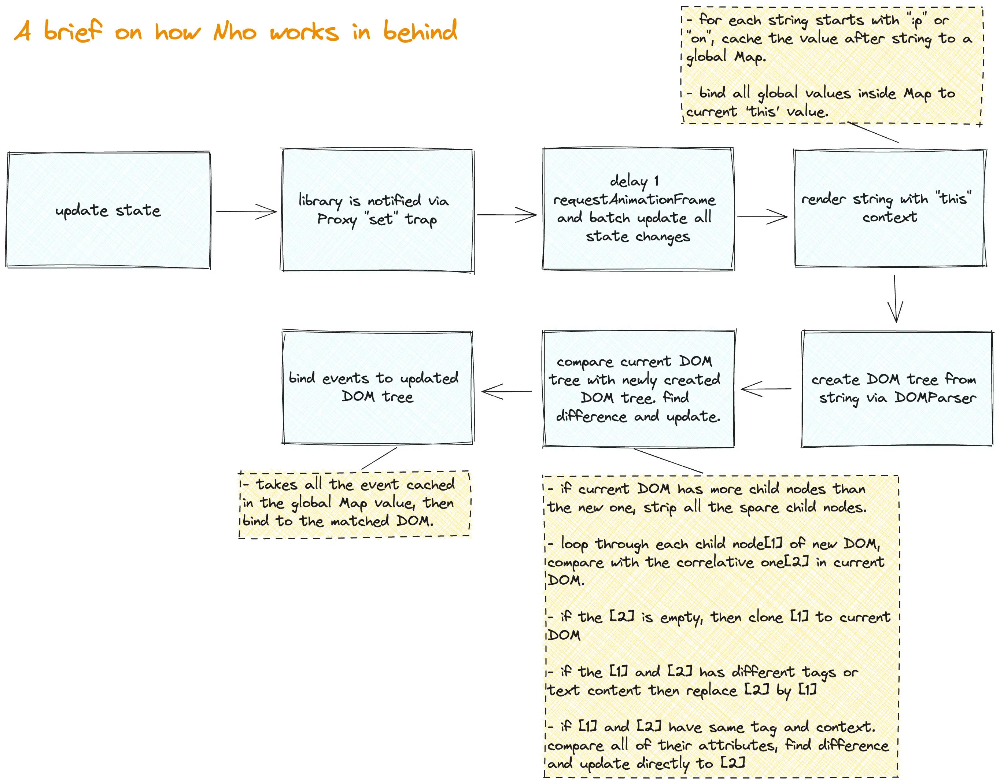

## 📌 Nho

Nho (`nhỏ` | `small` in `Vietnamese`) is a tiny library designed for easy Web Component development.

### Why Nho?

- Writing a Web Component (WC) using vanilla JavaScript can be such tedious. Alternatively, popular WC libraries can be overkill and overweighted (4KB+) for creating small components like a `"Buy now" button` or a `cart listing`.

- `Nho` simplifies the process by staying lightweight, removing unnecessary APIs, and using a simple DOM diffing algorithm.

### Features

- `1.3KB` gzipped.
- Simple API inspired from `Vue`.


### Example
- [album list](https://nho-example.netlify.app/) - [source](./example)

### Limitation

- In order to stay small, `Nho` skips few advanced features found in popular front-end frameworks like `key`, `Fragments`, `memo`. The DOM diffing algorithm is somewhat basic, but it is fast enough for small projects. If your components become too complex, consider other options.

### Installation

#### using `npm`
First, run

```
npm install nho
```

then
```js
import { Nho } from 'nho';
class MyCounterChild extends Nho {}
```


#### using `CDN`
First, add `script` to the `html` file
```html
<script src="https://unpkg.com/nho"></script>
```

then, add `script` to the `html` file

```html
<script>
  let Nho = nho.Nho;
  class MyCounterChild extends Nho {}
</script>
```

### Usage

```js
/* main.js */

/* declare global style. Styles will be injected to all Nho Elements */
Nho.style = `
  .box {
    background: blue;
    color: yellow;
  }
`

class MyCounterChild extends Nho {
  render(h) {
    /* bind value from props */
    return h`<div>Child: ${this.props.count}</div>`
  }
}

class MyCounter extends Nho {
  setup() {
    /* this method runs before mount */

    /* create component state using "this.reactive", state must be an object */
    this.state = this.reactive({ count: 1 });

    /* only use ref for storing DOM reference */
    this.pRef = this.ref();

    /* effect */
    this.effect(
      // effect value: fn -> value
      () => this.state.count,
      // effect callback: fn(old value, new value)
      (oldValue, newValue) => {
        console.log(oldValue, newValue)
      }
    )
  }

  onMounted() {
    /* this method runs after mount */
    console.log('Mounted');
  }

  onUpdated() {
    /* this method runs after each update. */
    console.log('Updated');

    /* P tag ref */
    console.log('P Ref', this.pRef?.current);
  }

  onUnmounted() {
    /* this method runs before unmount */
    console.log('Before unmount');
  }

  addCount() {
    /* update state by redeclaring its key-value. Avoid updating the whole state. */
    this.state.count += 1;
  }

  render(h) {
    /* this method is used to render */

    /*
      JSX template alike
      - Must have only 1 root element
      - Bind state / event using value in literal string
      - Pass state to child element using props with 'p:' prefix
     */
    return h`
      <div class="box">
        <p ref=${this.pRef}>Name: ${this.state.count}</p>
        <button onclick=${this.addCount}>Add count</button>
        <my-counter-child p:count=${this.state.count + 5}></my-counter-child>
      </div>
    `
  }
}

customElements.define("my-counter", MyCounter);
customElements.define("my-counter-child", MyCounterChild);
```

```html
/* index.html */
<my-counter></my-counter>
```

### Notice
- **Avoid** using these below properties inside Nho Component since they are reversed Nho's properties.


```
setup, onMounted, onUnmounted, onUpdated, effect, ref, reactive, render, style
```

```
any property that starts with `_`
```

### How it works

- It's better to dive into the code, but here is a quick sketch about how `Nho` works.



### Mentions

- [Frontend Focus's #651 issue](https://frontendfoc.us/issues/651)
