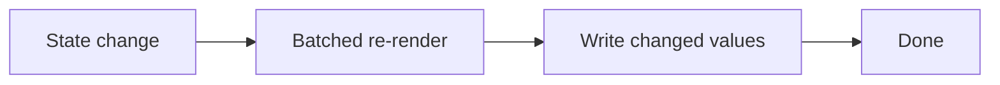

# 📌 Nho

> `nhỏ` — "small" in Vietnamese

Reactive Web Components. **1.4KB** gzipped, zero deps.

[**Live demo: Ecommerce Cart**](https://nho-example.netlify.app/) · [source](./example)

## Install

```sh
echo '@anh-ld:registry=https://npm.pkg.github.com' >> .npmrc
npm install @anh-ld/nho
```

No build step, esm.sh serves it from GitHub:

```html
<script type="module">
  import { Nho } from "https://esm.sh/gh/anh-ld/nho";
</script>
```

Pin a release: `https://esm.sh/gh/anh-ld/nho@0.4.0`

## Quick start

```js
import { Nho } from "@anh-ld/nho";

/* injected into every element */
Nho.style = `li { list-style: none; }`;

class TodoItem extends Nho {
  render(h) {
    return h`
      <li class=${this.props.done ? "done" : ""}>
        ${this.props.label}
        <button onclick=${() => this.props.onremove(this.props.label)}>x</button>
      </li>
    `;
  }
}

class TodoList extends Nho {
  setup() {
    this.state = { items: ["milk"] };
    this.inputRef = this.ref();

    /* runs when the value changes */
    this.effect(
      () => this.state.items.length,
      (before, after) => console.log(before, "->", after),
    );
  }

  onMounted() {
    this.inputRef.current.focus();
  }

  add() {
    this.setState({ items: [...this.state.items, this.inputRef.current.value] });
  }

  remove(label) {
    this.setState({ items: this.state.items.filter((i) => i !== label) });
  }

  render(h) {
    return h`
      <input ref=${this.inputRef} placeholder="add item" />
      <button onclick=${this.add}>Add</button>

      <ul>
        ${this.state.items.map((label) => h`<todo-item label=${label} onremove=${this.remove}></todo-item>`)}
      </ul>

      ${this.state.items.length ? "" : h`<p>nothing left</p>`}
    `;
  }
}

customElements.define("todo-item", TodoItem);
customElements.define("todo-list", TodoList);
```

```html
<todo-list></todo-list>
<todo-item label="milk" done="yes"></todo-item>
```

## API

Component:

- `setup()` — once, before mount.
- `render(h)` — returns the template.
- `state` — plain object, set in `setup()`.
- `setState(patch)` — merges, one re-render per frame.
- `effect(valueFn, cb)` — `cb(before, after)` when `valueFn()` changes.
- `ref(initial?)` — returns `{ current }`.
- `props` — host attributes and parent values.
- `onMounted()` `onUpdated()` `onUnmounted()` — optional.
- `Nho.style` — CSS for every element.
- `html` — the tag `render` receives, for use outside a component.

Template:

- `${value}` — a primitive, a nested `h` template, or an array of either.
- `attr=${value}` — attribute, dropped on `null` `undefined` `false`.
- `attr=${value}` on `<custom-el>` — prop, functions keep the parent as `this`.
- `onclick=${fn}` — DOM event, bound to the component.
- `ref=${obj}` — sets `obj.current` to the node.

> [!NOTE]
> Members above and anything starting with `_` are reserved.

## Editor

- VS Code: install [lit-html](https://marketplace.visualstudio.com/items?itemName=bierner.lit-html) for HTML highlighting in templates.
- It keys off the tag name — name the `render` param `html`.

```js
render(html) {
  return html`<p>${this.state.count}</p>`;
}
```

## How it works


```mermaid
flowchart LR
  A[State change] --> B[Batched re-render] --> C[Write changed values] --> D[Done]
```

- Compile once — browser parses the static HTML, Nho records where each `${}` sits.
- Render — clone the skeleton, write the changed values.
- Static DOM is never re-created, re-parsed, or diffed.

## Limitations

> [!IMPORTANT]
> Deliberately small. Complex UI? Use a full framework.

- No `key` — lists diff by index, reordered items drift.
- Custom-element attributes are props — `class=${x}` won't style, use a static `class`.
- HTML lowercases names — `onBuy=${fn}` arrives as `props.onbuy`.
- Bare host attributes are `""` — `<my-el done>` is falsy, use `done="yes"`.
- No holes in `<style>` or `<textarea>` — use `Nho.style`.
- Holes go in text or in an attribute value — not in a tag name (`<${tag}>`), an attribute name (`<p ${attr}>`), or an HTML comment.
- Host attributes are read once at mount — change props from the parent, not with `setAttribute`.
- Only `setState` re-renders, and it merges shallowly — replace nested objects and arrays, never mutate.
- Falsy follows React — `null` `undefined` `true` `false` render nothing, `0` renders.
- Text holes take primitives — a plain object with an `s` key reads as a template.

## Development

`Bun 1.4+`

```sh
bun install
bun run dev     # example at ./example
bun test        # ./test/unit, jsdom via test/unit/env.js
bun run e2e     # ./test/e2e, real WebKit via Bun.WebView, against dist/
bun run check   # biome format + lint
bun run build   # dist/index.es.js + dist/index.umd.js
```

## Mentions

- [Frontend Focus #651](https://frontendfoc.us/issues/651)
