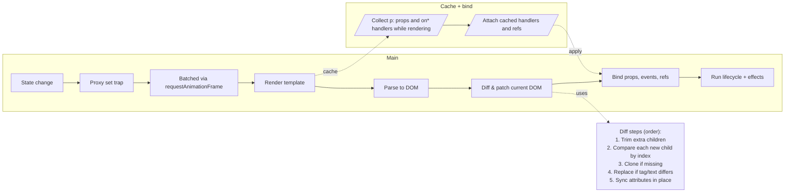

## 📌 Nho

Nho (`nhỏ` | `small` in `Vietnamese`) is a tiny library designed for building simple Web Component.

### Why Nho?

- Vanilla JS is tedious; popular WC frameworks are overkill (4KB+) for small components like a `buy now button` or `cart drawer`.
- `Nho` offers a minimal, Vue-inspired API with basic DOM diffing which is fast enough for lightweight use cases.

### Features

- `1.2KB` gzipped  (`1306 bytes` for `esm` and `1554 bytes` for `umd`)
- Simple API inspired from `Vue`
- `100%` test coverage

### Example
- [Album List](https://nho-example.netlify.app/) - [Source](./example)

### Limitation

- Omits advanced features: `key`, `Fragments`, `memo`, etc
- Basic DOM diffing—suitable only for small to medium components. For complex UIs, use a full-fledged framework

### Installation

#### using `npm`
First, run

```
npm install nho
```

> The package is published on `npm`, so other package managers (e.g. `yarn`, `pnpm`, `bun`) still work

then
```js
import { Nho } from 'nho';
class MyCounterChild extends Nho {}
```


#### using `CDN`
First, add `script` to the `html` file
```html
<script src="https://unpkg.com/nho"></script>
```

then, add `script` to the `html` file

```html
<script>
  let Nho = nho.Nho;
  class MyCounterChild extends Nho {}
</script>
```

### Usage

```js
/* main.js */

/* declare global style. Styles will be injected to all Nho Elements */
Nho.style = `
  .box {
    background: blue;
    color: yellow;
  }
`

class MyCounterChild extends Nho {
  render(h) {
    /* bind value from props */
    return h`<div>Child: ${this.props.count}</div>`
  }
}

class MyCounter extends Nho {
  setup() {
    /* this method runs before mount */

    /* create component state using "this.reactive", state must be an object */
    this.state = this.reactive({ count: 1 });

    /* only use ref for storing DOM reference */
    this.pRef = this.ref();

    /* effect */
    this.effect(
      // effect value: fn -> value
      () => this.state.count,
      // effect callback: fn(old value, new value)
      (oldValue, newValue) => {
        console.log(oldValue, newValue)
      }
    )
  }

  onMounted() {
    /* this method runs after mount */
    console.log('Mounted');
  }

  onUpdated() {
    /* this method runs after each update. */
    console.log('Updated');

    /* P tag ref */
    console.log('P Ref', this.pRef?.current);
  }

  onUnmounted() {
    /* this method runs before unmount */
    console.log('Before unmount');
  }

  addCount() {
    /* update state by redeclaring its key-value. Avoid updating the whole state. */
    this.state.count += 1;
  }

  render(h) {
    /* this method is used to render */

    /*
      JSX template alike
      - Must have only 1 root element
      - Bind state / event using value in literal string
      - Pass state to child element using props with 'p:' prefix
     */
    return h`
      <div class="box">
        <p ref=${this.pRef}>Name: ${this.state.count}</p>
        <button onclick=${this.addCount}>Add count</button>
        <my-counter-child p:count=${this.state.count + 5}></my-counter-child>
      </div>
    `
  }
}

customElements.define("my-counter", MyCounter);
customElements.define("my-counter-child", MyCounterChild);
```

```html
/* index.html */
<my-counter></my-counter>
```

### Development (Bun)
- Install dependencies: `bun install`
- Build the library bundles: `bun run build`
- Build/watch the example app: `bun run dev` (outputs to `example/dist`, open `example/index.html`)
- Serve the example folder: `bun run serve` (default http://localhost:3000)
- Run tests: `bun test`

### Notice
- **Avoid** using these below properties inside Nho Component since they are reversed Nho's properties


```
setup, onMounted, onUnmounted, onUpdated, effect, ref, reactive, render, style
```

```
any property that starts with `_`
```

### Caveats

#### Literal string props on custom elements created outside `h`
- Literal string `p:` props on **DOM-created custom elements** are read as cached ids when patched
- `p:` values can resolve to `undefined` unless the element is **created inside `h`**

```html
<my-counter p:label="Hello"></my-counter>
```


#### No escaping for text interpolation
- Text interpolation inserts raw HTML into text nodes
- Untrusted input can render as HTML rather than plain text

```js
const userInput = "";
render(h) {
  return h`<p>${userInput}</p>`;
}
```


#### No keyed reordering in diffing
- List diffing is index-based and does not move nodes
- Reorders reuse existing DOM nodes, so item identity can drift

```js
render(h) {
  return h`<ul>${items.map((item) => h`<li>${item.name}</li>`)}</ul>`;
}
```


### How it works

- It's better to dive into the code, but here is a diagram about how `Nho` works


```mermaid
flowchart LR
  subgraph Main
    direction LR
    A[State change] --> B[Proxy set trap]
    B --> C[Batched via requestAnimationFrame]
    C --> D[Render template]
    D --> E[Parse to DOM]
    E --> F[Diff & patch current DOM]
    F --> G[Bind props, events, refs]
    G --> H[Run lifecycle + effects]
  end

  subgraph Cache[Cache + bind]
    direction TB
    N1[/Collect p: props and on* handlers while rendering/]
    N2[/Attach cached handlers and refs/]
    N1 --> N2
  end
  D -. cache .-> N1
  N2 -. apply .-> G

  R["Diff steps (order):<br>1. Trim extra children<br>2. Compare each new child by index<br>3. Clone if missing<br>4. Replace if tag/text differs<br>5. Sync attributes in place"]
  F -. uses .-> R
```

### Mentions

- [Frontend Focus's #651 issue](https://frontendfoc.us/issues/651)
