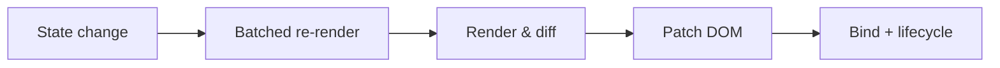

# 📌 Nho

> `nhỏ` — "small" in Vietnamese

A tiny (`~1.2KB` gzipped) library for building Web Components.

- **Small** — `1291 bytes` (esm), `1533 bytes` (umd), gzipped
- **Familiar** — Vue-inspired API
- **Simple** — reactive state, lifecycle hooks, effects, refs
- **Tested** — `100%` coverage

[**Live demo: Ecommerce Cart**](https://nho-example.netlify.app/) · [source](./example)

## Why?

Vanilla Web Components are tedious, full frameworks are overkill — Nho is the happy middle: tiny, reactive, no fuss.

## Install

Nho is published to **GitHub Packages** under the `@anh-ld` scope. Point the scope at the GitHub registry in your `.npmrc`:

```
@anh-ld:registry=https://npm.pkg.github.com
```

Then install:

```sh
npm install @anh-ld/nho
```

```js
import { Nho } from "@anh-ld/nho";

class MyCounter extends Nho {}
```

## Usage

```js
/* Global styles — injected into every Nho element */
Nho.style = `
  .box { background: blue; color: yellow; }
`;

class MyCounterChild extends Nho {
  render(h) {
    return h`<div>Child: ${this.props.count}</div>`;
  }
}

class MyCounter extends Nho {
  setup() {
    /* runs before mount */
    this.state = this.reactive({ count: 1 }); /* state must be an object */
    this.pRef = this.ref(); /* holds a DOM reference */

    /* run callback whenever the value changes */
    this.effect(
      () => this.state.count,
      (oldValue, newValue) => console.log(oldValue, newValue),
    );
  }

  /* lifecycle hooks — all optional */
  onMounted() {
    console.log("mounted");
  }
  onUpdated() {
    console.log("updated, p ref:", this.pRef.current);
  }
  onUnmounted() {
    console.log("before unmount");
  }

  addCount() {
    /* reassign a key — don't replace the whole state object */
    this.state.count += 1;
  }

  render(h) {
    /* one root element; bind state/events inline; pass props with "p:" */
    return h`
      <div class="box">
        <p ref=${this.pRef}>Count: ${this.state.count}</p>
        <button onclick=${this.addCount}>Add</button>
        <my-counter-child p:count=${this.state.count + 5}></my-counter-child>
      </div>
    `;
  }
}

customElements.define("my-counter", MyCounter);
customElements.define("my-counter-child", MyCounterChild);
```

```html
<my-counter></my-counter>
```

## API

| Member | Description |
| --- | --- |
| `setup()` | Runs before mount. Initialize state, refs, effects here. |
| `render(h)` | Returns the template. `h` is a tagged-template helper. |
| `reactive(obj)` | Returns reactive state; mutating a key triggers a batched re-render. |
| `ref(initial?)` | Returns `{ current }`, for DOM references via `ref=`. |
| `effect(valueFn, cb)` | Runs `cb(old, new)` when `valueFn()` changes between updates. |
| `onMounted()` / `onUpdated()` / `onUnmounted()` | Lifecycle hooks. |
| `Nho.style` | Static string of CSS injected into every element. |

> **Reserved** — don't define your own members named above, `props`, or anything starting with `_`.

## How it works


```mermaid
flowchart LR
  A[State change] --> B[Batched re-render] --> C[Render & diff] --> D[Patch DOM] --> E[Bind + lifecycle]
```

Diffing is index-based: trim extra children, compare each child by index, clone if missing, replace on tag/text mismatch, and sync attributes in place. Props, `on*` handlers, and `ref`s are cached during render and re-attached after patching.

## Limitations

- No `key`, `Fragments`, or `memo` — basic diffing, best for small/medium components.
- **No keyed reordering** — list diffing is index-based, so reordered items reuse existing nodes and identity can drift.
- **No escaping in text interpolation** — interpolated values insert raw HTML. Don't pass untrusted input into templates.
- **`p:` props need `h`** — string `p:` props on custom elements created outside `h` resolve to `undefined`; create them inside `h`.

For complex UIs, use a full framework.

## Development (Bun)

```sh
bun install        # dependencies
bun run build      # build library bundles
bun run dev        # build/watch the example (open example/index.html)
bun run serve      # serve the example folder
bun test           # run tests
```

## Mentions

- [Frontend Focus #651](https://frontendfoc.us/issues/651)
